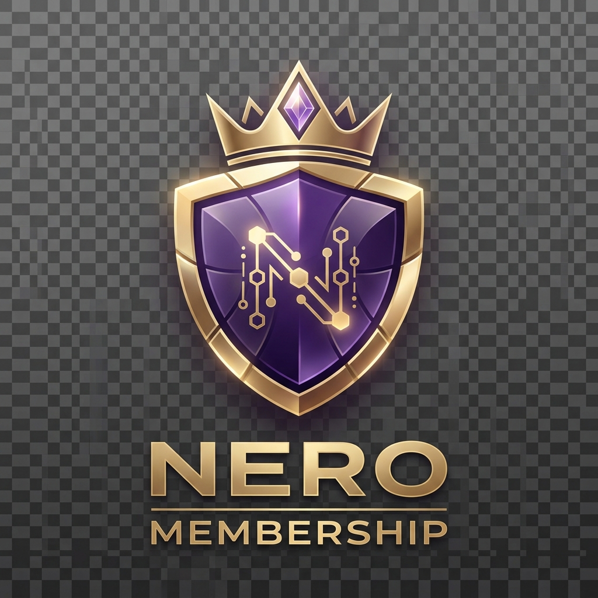
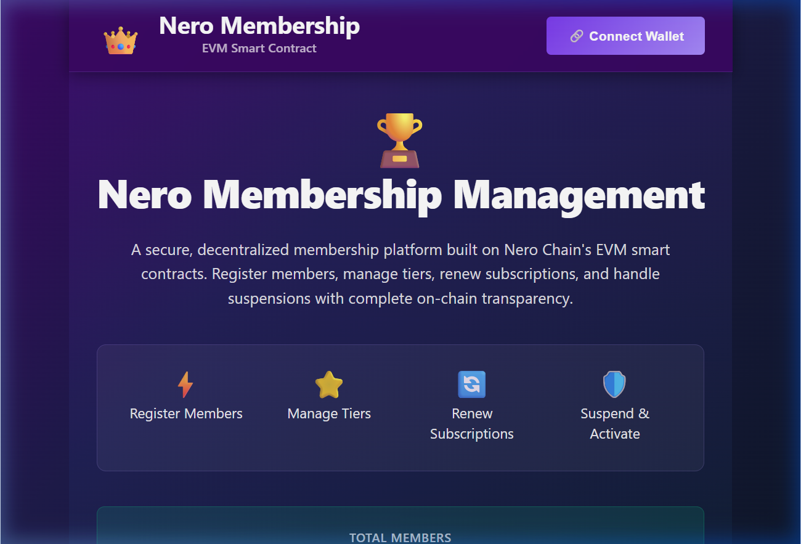
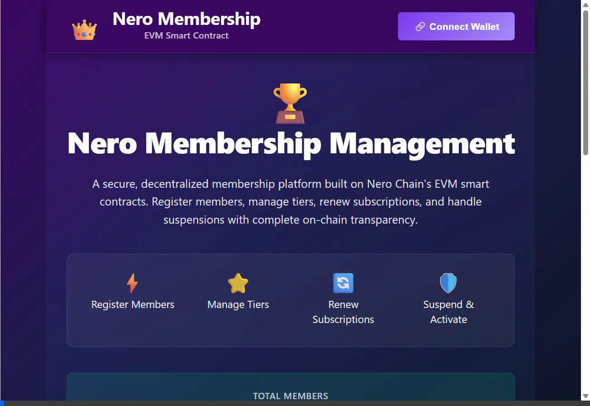
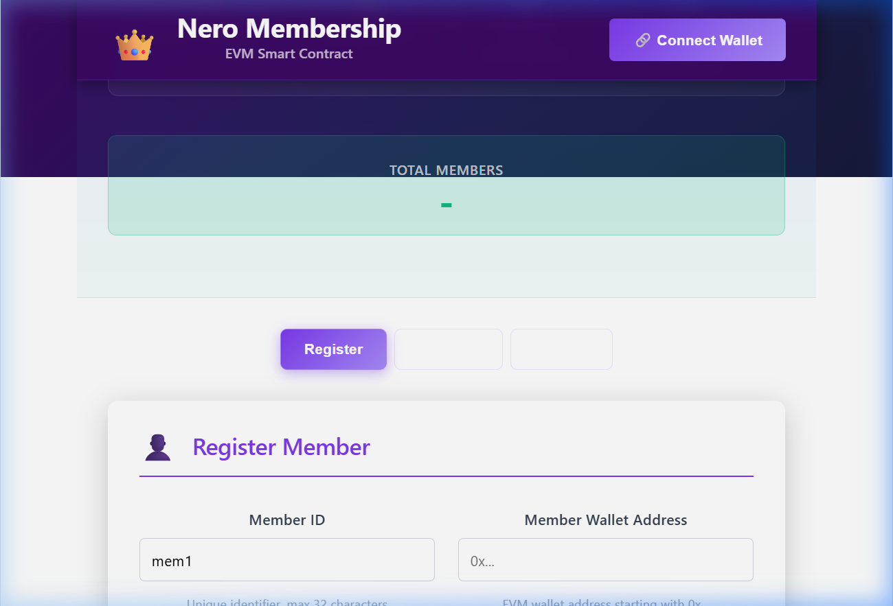
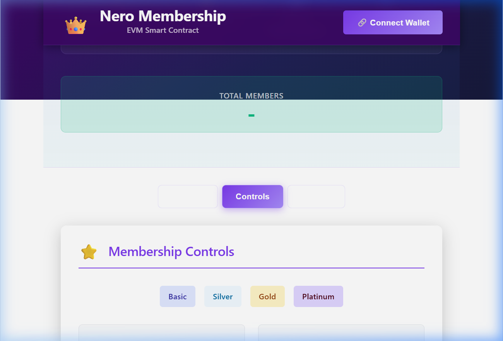

#  Nero Membership Management

A premium, decentralized membership ecosystem built on **Nero Chain** (EVM). This platform enables organizations to manage memberships with complete on-chain transparency, featuring multi-tier management, automated renewal tracking, and admin-controlled status management.

---

## 🌟 Visual Preview

### Dashboard Overview


### Core Features Demo


---

## 🚀 Key Features

- **Decentralized Registration**: On-board members with unique IDs, names, and contact details directly on the Nero blockchain.
- **Dynamic Tier System**: Support for multiple membership levels (**Basic**, **Silver**, **Gold**, **Platinum**) with easy upgrading logic.
- **Automated Renewals**: Transparent expiration tracking and one-click subscription renewals.
- **Administrative Control**: Secure functions for suspending or reactivating members, restricted to the contract owner.
- **Global Member Directory**: Instant access to the complete list of registered members and total membership counts.

---

## 🛠️ Technology Stack

| Layer | Technology |
| --- | --- |
| **Blockchain** | Nero Chain (EVM Compatible) |
| **Smart Contracts** | Solidity ^0.8.24 |
| **Frontend** | React 19 + Vite 6 |
| **Styling** | Vanilla CSS (Premium Royal Theme) |
| **Provider** | Ethers.js v6 |
| **Development** | Hardhat |

---

## 📸 Snapshots

| Registration Flow | Membership Controls |
| --- | --- |
|  |  |

---

## 📖 Getting Started

### Prerequisites

- **Node.js**: Version 18 or higher.
- **Wallet**: MetaMask or any EVM-compatible wallet.
- **Gas**: NERO testnet tokens for transactions. [Get them here](https://app.testnet.nerochain.io/faucet).

### Installation

1. **Clone the Project**:
   ```bash
   git clone https://github.com/PRATYAYCHATTERJEE/Membership_management.git
   cd nero-membership-management
   ```

2. **Install Dependencies**:
   ```bash
   npm install
   ```

3. **Environment Setup**:
   Create a `.env` file in the root directory:
   ```env
   PRIVATE_KEY=your_private_key_here
   CONTRACT_ADDRESS=your_deployed_contract_address
   ```

### Smart Contract Deployment

1. **Compile**:
   ```bash
   npx hardhat compile
   ```

2. **Deploy to Nero Testnet**:
   ```bash
   npx hardhat run scripts/deploy.cjs --network neroTestnet
   ```

### Running Locally

1. **Start Dev Server**:
   ```bash
   npm run dev
   ```

2. **Open in Browser**: Navigate to `http://localhost:5173/`.

---

## 🏗️ Project Structure

- `contracts/`: Solidity source code for the membership logic.
- `scripts/`: Deployment and maintenance scripts (balance checks, verification).
- `src/lib/nero.js`: Ethers.js integration for blockchain communication.
- `assets/media/`: Visual assets, logo, and demo clips.

---

## 🛡️ Security

- **Private Keys**: Never share your `.env` file. It is ignored by git for your protection.
- **Admin Roles**: Only the contract deployer can suspend or activate members.

---

## 🛠️ Developing on this Idea

This project is a foundation for decentralized membership systems. Here are some ways to expand it:

1. **NFT-Based Memberships**: Modify the contract to issue an ERC-721 token (NFT) upon registration. Tiers could be represented by different NFT metadata or collections.
2. **Subscription Payments**: Integrate a payment function where members must send NERO tokens to register or renew.
3. **Governance Integration**: Use membership status to grant voting rights in a DAO (Decentralized Autonomous Organization).
4. **On-Chain Perks**: Create secondary contracts that check membership status to provide access to exclusive content or DeFi rewards.

---

**Developed for the Nero Chain Ecosystem.**
